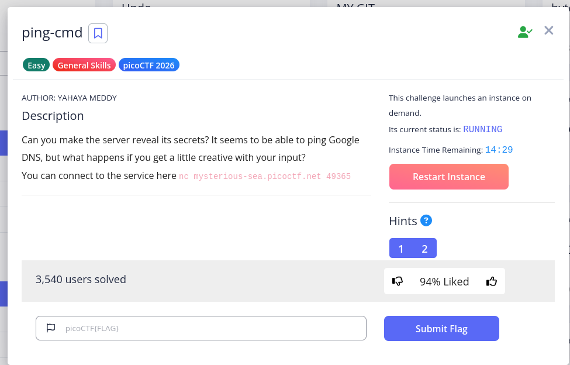
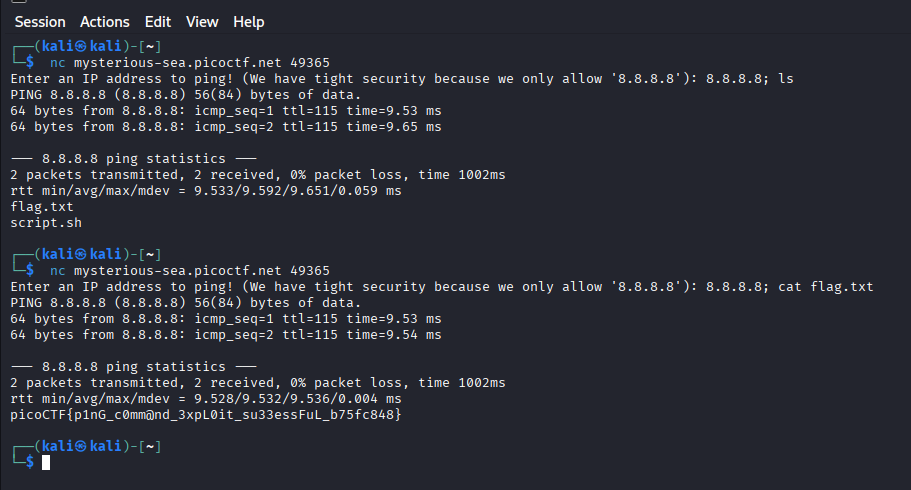

# ping-cmd

Category: General Skills  
Difficulty: Easy  
Author: Yahaya Meddy  

  

Title:  
ping-cmd  
Text:  
Can you make the server reveal its secrets? It seems to be able to ping Google DNS, but what happens if you get a little creative with your input? You can connect to the service here `nc mysterious-sea.picoctf.net  <port number>`  

---

### Solution Path

command injection:  
use the approved ip address `8.8.8.8` followed by a semi-colon `;`, after which you can inject an additional command: `cat flag.txt`.  
`8.8.8.8; cat flag.txt`  

---

### My Process

I opened a terminal in Kali Linux and pasted the command I had copied from the challenge description:  
`nc mysterious-sea.picoctf.net  <port number>`  
(where `<port number>` is a number that will change depending on the challenge instance)  

Then I saw the prompt:  
`Enter an IP address to ping! (We have tight security because we only allow `8.8.8.8`):`  

So I tried `8.8.8.8` and it pinged successfully and then closed the connection.  

Then I connected again and tried `127.0.0.1` which pinged successfully and closed the connection.  
So much for being clever.  

At that point, I was out of ideas, so I asked perplexity.ai about the challenge and it said something along the lines of:  
"This is a classic command injection" and suggested attaching commands to the accepted IP address with a semi-colon `;`.  

I`ve used the Linux CLI before. The use of the semi-colon was familiar to me and seemed like an obvious thing to try once it was suggested.  

So first I tried:  
`8.8.8.8; ls`

and saw the ping succeed, followed by a list of files, one of which was `flag.txt`  

So the next move seemed obvious:  

`8.8.8.8; cat flag.txt`  

...and *voila*  

---

### Lessons Learned

- when you have a legitimate command that is accepted, try injecting your own commands along with it
- using a semi-colon is a simple way to chain an additional commmand on to the first command
