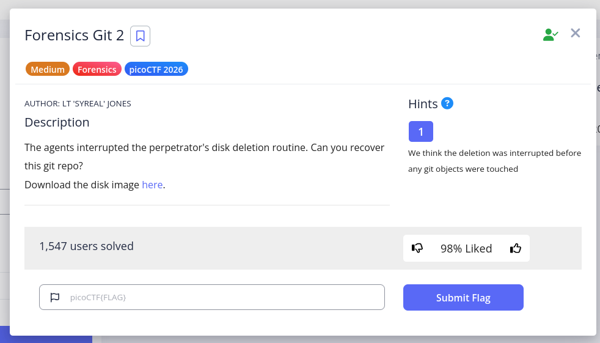

# Forensics Git 2

Category: Forensics  
Difficulty: Medium  
Author: LT 'SYREAL' JONES



Title:  
Forensics Git 2  
Description:  
The agents interrupted the perpetrators disk deletion routine. Can you recover the git repo?  
Hints: 1
- We think the deletion was interrrupted before any git objects were touched

---
### Tools Used

- Kali Linux with The Sleuth Kit (TSK) and Git

### Solution Path

- Use `fdisk` to find the disk partition and `mount` using the offset
- `find` the directory containing the `.git` file and cd into that dir
- Enumerate orphaned objects with `find .git/objects -type f` and `fsck`
- Dump all object content with `git cat-file` and grep 'pico' to get the flag

---

### My Process

I used perplexity.ai to help me out on this one. I followed along every step of the way but I'm still working on understand the very last command that got the flag.

But let's start at the beginning.

I downloaded the disk image from the link in the challenge.

I initially thought I should use Autopsy, but perplexity told me that Sleuth Kit via the command line would work better, so we did that, and after we started I realized that's what I was thinking of anyway. As it turned out, we only used one Sleuth Kit command anyway, and that ended up being a tangent/dead-end. The real work was all done via Linux or Git tools.

To start, we used 'fdisk' to check out the disk image.

```
┌──(kali㉿kali)-[~/Downloads]
└─$ fdisk -l 2disk.img

Disk 2disk.img: 1 GiB, 1073741824 bytes, 2097152 sectors
Units: sectors of 1 * 512 = 512 bytes
Sector size (logical/physical): 512 bytes / 512 bytes
I/O size (minimum/optimal): 512 bytes / 512 bytes
Disklabel type: dos
Disk identifier: 0x610b63c2

Device     Boot   Start     End Sectors  Size Id Type
2disk.img1 *       2048  616447  614400  300M 83 Linux
2disk.img2       616448 1140735  524288  256M 82 Linux swap / Solaris
2disk.img3      1140736 2097151  956416  467M 83 Linux
```

Partition 1 had the boot flag `*`  
Partition 2 was swap space  
This leaves partition 3, and along with the fact that it's the largest partition, we decided to mount and examine this one:  

```
┌──(kali㉿kali)-[~/Downloads]
└─$ sudo mkdir /mnt/disk
sudo mount -o loop,offset=$((1140736*512)) 2disk.img /mnt/disk
```

Then, a simple recursive `find` scans the mounted filesystem for any `.git` directory. `2>/dev/null` suppresses permission errors. The result finds one extremely likely candidate:  
```
┌──(kali㉿kali)-[~/Downloads]
└─$ find /mnt/disk -name ".git" -type d 2>/dev/null

/mnt/disk/home/ctf-player/Code/killer-chat-app/.git
```

We used `fls` from The Sleuth Kit.
```
fls -r -d 2disk.img -o 1140736 | grep -iE "git|HEAD|COMMIT|objects"
```
- the `-d` flag lists deleted files
- the `-o` flag specifies the partition offset (1140736), which we found with fdisk earlier

This `fls` command didn't reveal much that was useful:
```
┌──(kali㉿kali)-[~/Downloads]
└─$ fls -r -d 2disk.img -o 1140736 | grep -iE "git|HEAD|COMMIT|objects"

l/l * 65546(realloc):   usr/libexec/git-core/.apk.fdd732dda690632410861ee6af39181d3893543354d29a2f
l/l * 65579(realloc):   usr/libexec/git-core/.apk.a977403b016612e0a90da24c24072a39146b385312288815
l/l * 65583(realloc):   usr/libexec/git-core/.apk.45212ae72a086ec160c095c91dc4162f2d73197618494912
-/- * 0:        usr/libexec/git-core/@
```

So then we used cd to get into the directory we found containing the `.git` file, checked the commit log, which revealed nothing, and then looked for orphaned files:
```
┌──(kali㉿kali)-[~/Downloads]
└─$ cd /mnt/disk/home/ctf-player/Code/killer-chat-app 
                                                                                                                                                                                                                                          
┌──(kali㉿kali)-[/mnt/…/home/ctf-player/Code/killer-chat-app]
└─$ git log --oneline --all
                                                                                                                                                                                                                                          
┌──(kali㉿kali)-[/mnt/…/home/ctf-player/Code/killer-chat-app]
└─$ git log --oneline      
fatal: your current branch 'master' does not have any commits yet
                                                                                                                                                                                                                                          
┌──(kali㉿kali)-[/mnt/…/home/ctf-player/Code/killer-chat-app]
└─$ find .git/objects -type f

.git/objects/aa/1cc01687b4ec94faf9916c3fc6efd83f23b816
.git/objects/26/b809e0c41d8421f1126ed3a4eb06ad66e6d90a
.git/objects/f1/50f0b963ab3ee95ba5656212abd76d7f2fed2e
.git/objects/5e/b896e3ccd51175f66480cdb247fc45f3e8ac2d
.git/objects/e8/0b38b3322a5ba32ac07076ef5eeb4a59449875
.git/objects/6b/1ebe10826d5c1efc58ae475c0a0af10f580b77
.git/objects/6b/f83de540f7d12cc3b683a83d69432e03d84509
.git/objects/2c/0a9b2b15dce92f800393d5030c7454efc278ae
.git/objects/d4/666b9472fad7cd75d05b641e402347d9aac605
.git/objects/ea/d27e2bd5a0fc22868ffb629a768f82dfcda11c
.git/objects/22/f7d0c9bd045563ae33bfacfbe46fe406a5b318
.git/objects/c9/31ae0868411e5f23656a2436e78a4c4699e18c
.git/objects/20/1c707b43219a63c1d3499b29c7d539af079861
.git/objects/21/51ef0ccc15aed1ab88e1afdc7484aaeff211c4
.git/objects/58/27632e046a80a1e0d7b4fc5c7800dd539baeaf
.git/objects/d7/b4a371ebd23e682ffebc7ec355690fdc94fbd1
.git/objects/a0/c13fe974d95661f24e32bc0d79f54f05ea13c5
.git/objects/66/273877d2ff3f51a14473b7200aae5a798ff64f
.git/objects/71/78644433e7cb6da3adf028f1c80d382a18e7b6
.git/objects/71/fd2fafcd5ebd62fbf857769c92a91225ab3954
.git/objects/01/533f718556a0e59f1467dae4fa462eed82c2a1
```

The find command above just looked in the `.git/objects` directory, using the `-type f` tag to look specifiically for regular files.

Next, we used `git fsck` to confirm the files we found above are orphaned.  
```
┌──(kali㉿kali)-[/mnt/…/home/ctf-player/Code/killer-chat-app]
└─$ git fsck --full

Checking ref database: 100% (1/1), done.
Checking object directories: 100% (256/256), done.
notice: HEAD points to an unborn branch (master)
notice: No default references
```

The command `git fsck` is borrowing the Unix naming convention for the command initiating a filesystem check: `fsck` and applies a check to the git object store.
- It starts from all known references — branch pointers, tags, HEAD, the reflog, etc.  
- It walks the object graph forward from those references, following every commit → tree → blob chain it can reach.  
- Any object file sitting in .git/objects/ that was never reached during that walk is reported as dangling/unreferenced. Here, nothing was found from the very beginning of the object graph, so there is no list of dangling/unreferenced files. The complete lack of any references means that the files we found above are, indeed, orphaned.  

### Git object files and reading the files
The files found in .git/objects are created by Git, containing whatever data that was going to be saved. The file path and name are auto-created by Git, using a SHA-1 hash of the file data, split into the first 2 digits being a directory, and the remaining digits the file name.  
The data in these files is just sitting there ready to read, but it's compressed and wrapped by Git in a particular way, so it's simplest to use Git to read them with `git cat-file`. HOWEVER, `git cat-file` doesn't take a regular file path like many commands we are used to. Instead, it takes the full 40 character SHA-1 hash, for somme reason.

So we need to take the list of files that we have above, and one by one, remove the `.git/objects/` and the `/` in the middle of the hash. This is done with a `sed` command, as seen below.

The final command shown below incorporates `git cat-file` and a while loop:
- `find` all regular files in .git/objects, same as above.
- Pipe each file name to a `sed` command which substitutes with `s`. So `s|.git/objects||` effectively deletes '.git/objects' from each file path like this: `s|find '.git/objects'|replace with ''`. The remaining `/` is removed in the same way, leaving the full hash value.
- `while read hash` is the while loop, which says that while it can read a hash value result piped from the sed command into a variable named `hash` (could be named anything) it should `do` the next thing.
- The `do` part of the loop uses `git cat-file` to read the data defined by the hash value contained in the variable `$hash` while `-p` says to print the data in a human-readable format, or "pretty-print", and pipe it into the final grep section. (The `2>/dev/null`, again, just bypasses any permissions errors so the results aren't cluttered)
- Finally, the `grep -i pico` looks for anything matching the string 'pico', the `-i` means case-insensitive.

There is only one line which contains the string 'pico':

```
┌──(kali㉿kali)-[/mnt/…/home/ctf-player/Code/killer-chat-app]
└─$ find .git/objects -type f | sed 's|.git/objects/||;s|/||' | while read hash; do
    git cat-file -p $hash 2>/dev/null
done | grep -i pico

Jay: Ask Rusty at the door and use password picoCTF{g17_r35cu3_16ac6bf3}.
```

### Lessons Learned

- Git filesystem: specifically the creation of objects and the file naming convention
- git cat-file uses a hash value, not a file path
- sed substitution with `s|find this|replace with this|`
- be careful about what you put into Git
